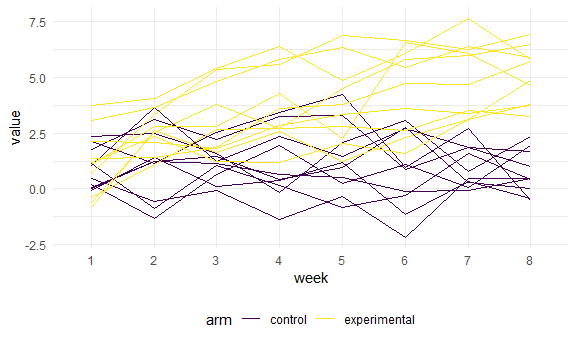

Homework 5
================
Safiya Sirota
2021-11-20

-   [Problem 1](#problem-1)
-   [Problem 2](#problem-2)
-   [Problem 3](#problem-3)

## Problem 1

**Importing and cleaning the data**

``` r
homicide_df <-
  read_csv("./data/homicide-data.csv", na = c("", "Unknown")) %>% 
  mutate(
    city_state = str_c(city, state),
    resolution = case_when(
      disposition == "Closed without arrest" ~ "unsolved",
      disposition == "Open/No arrest" ~ "unsolved",
      disposition == "Closed by arrest" ~ "solved"
    )
    ) %>% 
  relocate(city_state) %>% 
  filter(city_state != "TulsaAL")
```

    ## Rows: 52179 Columns: 12

    ## -- Column specification --------------------------------------------------------
    ## Delimiter: ","
    ## chr (8): uid, victim_last, victim_first, victim_race, victim_sex, city, stat...
    ## dbl (4): reported_date, victim_age, lat, lon

    ## 
    ## i Use `spec()` to retrieve the full column specification for this data.
    ## i Specify the column types or set `show_col_types = FALSE` to quiet this message.

**Focusing on Baltimore, MD**

``` r
baltimore_df <-
  homicide_df %>% 
  filter(city_state == "BaltimoreMD")

baltimore_summary <-
  baltimore_df %>% 
    summarize(
      unsolved = sum(resolution == "unsolved"),
      n = n()
    )

baltimore_test <-
  prop.test(
    x = baltimore_summary %>% pull(unsolved),
    n = baltimore_summary %>% pull(n)
  )

baltimore_test %>% 
  broom::tidy()
```

    ## # A tibble: 1 x 8
    ##   estimate statistic  p.value parameter conf.low conf.high method    alternative
    ##      <dbl>     <dbl>    <dbl>     <int>    <dbl>     <dbl> <chr>     <chr>      
    ## 1    0.646      239. 6.46e-54         1    0.628     0.663 1-sample~ two.sided

Let’s try to iterate across cities!

First off, write a function.

``` r
prop_test_function <- function(city_df) {

  city_summary <-
    city_df %>% 
      summarize(
        unsolved = sum(resolution == "unsolved"),
        n = n()
      )

  city_test <-
    prop.test(
      x = city_summary %>% pull(unsolved),
      n = city_summary %>% pull(n)
    )
  
 return(city_test)
  
}
  
prop_test_function(baltimore_df)
```

    ## 
    ##  1-sample proportions test with continuity correction
    ## 
    ## data:  city_summary %>% pull(unsolved) out of city_summary %>% pull(n), null probability 0.5
    ## X-squared = 239.01, df = 1, p-value < 2.2e-16
    ## alternative hypothesis: true p is not equal to 0.5
    ## 95 percent confidence interval:
    ##  0.6275625 0.6631599
    ## sample estimates:
    ##         p 
    ## 0.6455607

``` r
homicide_df %>% 
  filter(city_state == "AlbuquerqueNM") %>% 
  prop_test_function()
```

    ## 
    ##  1-sample proportions test with continuity correction
    ## 
    ## data:  city_summary %>% pull(unsolved) out of city_summary %>% pull(n), null probability 0.5
    ## X-squared = 19.114, df = 1, p-value = 1.232e-05
    ## alternative hypothesis: true p is not equal to 0.5
    ## 95 percent confidence interval:
    ##  0.3372604 0.4375766
    ## sample estimates:
    ##         p 
    ## 0.3862434

Now, let’s iterate across all cities.

``` r
results_df <-
  homicide_df %>% 
  nest(data = uid:resolution) %>% 
  mutate(
    test_results = map(data, prop_test_function),
    tidy_results = map(test_results, broom::tidy)
  ) %>% 
  select(city_state, tidy_results) %>% 
  unnest(tidy_results) %>% 
  select(city_state, estimate, starts_with("conf"))
```

Try to make a plot showing estimates and confidence intervals.

``` r
results_df %>% 
  mutate(city_state = fct_reorder(city_state, estimate)) %>% 
  ggplot(aes(x = city_state, y = estimate)) +   
  geom_point() +
    geom_errorbar(aes(ymin = conf.low, ymax = conf.high)) +
    theme(axis.text.x = element_text(angle = 90, vjust = 0.5, hjust = 1))
```


## Problem 2

Start with a dataframe containing all file names; the list.files
function will help

Iterate over file names and read in data for each subject using
purrr::map and saving the result as a new variable in the dataframe

Tidy the result; manipulate file names to include control arm and
subject ID, make sure weekly observations are “tidy”, and do any other
tidying that’s necessary

``` r
#list of filenames
files_df <-
  tibble(
    file = list.files("./data/zip_data")
  )

#making function
read_file <-
  function(filename) {
    
    subject_df <-
      read_csv(str_c("./data/zip_data/", filename))
    
    return(subject_df)
  }

#reading in data
experiment_df <- 
  files_df %>% 
    mutate(
      subj_data = map(file, read_file)
    )
```

    ## Rows: 1 Columns: 8

    ## -- Column specification --------------------------------------------------------
    ## Delimiter: ","
    ## dbl (8): week_1, week_2, week_3, week_4, week_5, week_6, week_7, week_8

    ## 
    ## i Use `spec()` to retrieve the full column specification for this data.
    ## i Specify the column types or set `show_col_types = FALSE` to quiet this message.

    ## Rows: 1 Columns: 8

    ## -- Column specification --------------------------------------------------------
    ## Delimiter: ","
    ## dbl (8): week_1, week_2, week_3, week_4, week_5, week_6, week_7, week_8

    ## 
    ## i Use `spec()` to retrieve the full column specification for this data.
    ## i Specify the column types or set `show_col_types = FALSE` to quiet this message.

    ## Rows: 1 Columns: 8

    ## -- Column specification --------------------------------------------------------
    ## Delimiter: ","
    ## dbl (8): week_1, week_2, week_3, week_4, week_5, week_6, week_7, week_8

    ## 
    ## i Use `spec()` to retrieve the full column specification for this data.
    ## i Specify the column types or set `show_col_types = FALSE` to quiet this message.

    ## Rows: 1 Columns: 8

    ## -- Column specification --------------------------------------------------------
    ## Delimiter: ","
    ## dbl (8): week_1, week_2, week_3, week_4, week_5, week_6, week_7, week_8

    ## 
    ## i Use `spec()` to retrieve the full column specification for this data.
    ## i Specify the column types or set `show_col_types = FALSE` to quiet this message.

    ## Rows: 1 Columns: 8

    ## -- Column specification --------------------------------------------------------
    ## Delimiter: ","
    ## dbl (8): week_1, week_2, week_3, week_4, week_5, week_6, week_7, week_8

    ## 
    ## i Use `spec()` to retrieve the full column specification for this data.
    ## i Specify the column types or set `show_col_types = FALSE` to quiet this message.

    ## Rows: 1 Columns: 8

    ## -- Column specification --------------------------------------------------------
    ## Delimiter: ","
    ## dbl (8): week_1, week_2, week_3, week_4, week_5, week_6, week_7, week_8

    ## 
    ## i Use `spec()` to retrieve the full column specification for this data.
    ## i Specify the column types or set `show_col_types = FALSE` to quiet this message.

    ## Rows: 1 Columns: 8

    ## -- Column specification --------------------------------------------------------
    ## Delimiter: ","
    ## dbl (8): week_1, week_2, week_3, week_4, week_5, week_6, week_7, week_8

    ## 
    ## i Use `spec()` to retrieve the full column specification for this data.
    ## i Specify the column types or set `show_col_types = FALSE` to quiet this message.

    ## Rows: 1 Columns: 8

    ## -- Column specification --------------------------------------------------------
    ## Delimiter: ","
    ## dbl (8): week_1, week_2, week_3, week_4, week_5, week_6, week_7, week_8

    ## 
    ## i Use `spec()` to retrieve the full column specification for this data.
    ## i Specify the column types or set `show_col_types = FALSE` to quiet this message.

    ## Rows: 1 Columns: 8

    ## -- Column specification --------------------------------------------------------
    ## Delimiter: ","
    ## dbl (8): week_1, week_2, week_3, week_4, week_5, week_6, week_7, week_8

    ## 
    ## i Use `spec()` to retrieve the full column specification for this data.
    ## i Specify the column types or set `show_col_types = FALSE` to quiet this message.

    ## Rows: 1 Columns: 8

    ## -- Column specification --------------------------------------------------------
    ## Delimiter: ","
    ## dbl (8): week_1, week_2, week_3, week_4, week_5, week_6, week_7, week_8

    ## 
    ## i Use `spec()` to retrieve the full column specification for this data.
    ## i Specify the column types or set `show_col_types = FALSE` to quiet this message.

    ## Rows: 1 Columns: 8

    ## -- Column specification --------------------------------------------------------
    ## Delimiter: ","
    ## dbl (8): week_1, week_2, week_3, week_4, week_5, week_6, week_7, week_8

    ## 
    ## i Use `spec()` to retrieve the full column specification for this data.
    ## i Specify the column types or set `show_col_types = FALSE` to quiet this message.

    ## Rows: 1 Columns: 8

    ## -- Column specification --------------------------------------------------------
    ## Delimiter: ","
    ## dbl (8): week_1, week_2, week_3, week_4, week_5, week_6, week_7, week_8

    ## 
    ## i Use `spec()` to retrieve the full column specification for this data.
    ## i Specify the column types or set `show_col_types = FALSE` to quiet this message.

    ## Rows: 1 Columns: 8

    ## -- Column specification --------------------------------------------------------
    ## Delimiter: ","
    ## dbl (8): week_1, week_2, week_3, week_4, week_5, week_6, week_7, week_8

    ## 
    ## i Use `spec()` to retrieve the full column specification for this data.
    ## i Specify the column types or set `show_col_types = FALSE` to quiet this message.

    ## Rows: 1 Columns: 8

    ## -- Column specification --------------------------------------------------------
    ## Delimiter: ","
    ## dbl (8): week_1, week_2, week_3, week_4, week_5, week_6, week_7, week_8

    ## 
    ## i Use `spec()` to retrieve the full column specification for this data.
    ## i Specify the column types or set `show_col_types = FALSE` to quiet this message.

    ## Rows: 1 Columns: 8

    ## -- Column specification --------------------------------------------------------
    ## Delimiter: ","
    ## dbl (8): week_1, week_2, week_3, week_4, week_5, week_6, week_7, week_8

    ## 
    ## i Use `spec()` to retrieve the full column specification for this data.
    ## i Specify the column types or set `show_col_types = FALSE` to quiet this message.

    ## Rows: 1 Columns: 8

    ## -- Column specification --------------------------------------------------------
    ## Delimiter: ","
    ## dbl (8): week_1, week_2, week_3, week_4, week_5, week_6, week_7, week_8

    ## 
    ## i Use `spec()` to retrieve the full column specification for this data.
    ## i Specify the column types or set `show_col_types = FALSE` to quiet this message.

    ## Rows: 1 Columns: 8

    ## -- Column specification --------------------------------------------------------
    ## Delimiter: ","
    ## dbl (8): week_1, week_2, week_3, week_4, week_5, week_6, week_7, week_8

    ## 
    ## i Use `spec()` to retrieve the full column specification for this data.
    ## i Specify the column types or set `show_col_types = FALSE` to quiet this message.

    ## Rows: 1 Columns: 8

    ## -- Column specification --------------------------------------------------------
    ## Delimiter: ","
    ## dbl (8): week_1, week_2, week_3, week_4, week_5, week_6, week_7, week_8

    ## 
    ## i Use `spec()` to retrieve the full column specification for this data.
    ## i Specify the column types or set `show_col_types = FALSE` to quiet this message.

    ## Rows: 1 Columns: 8

    ## -- Column specification --------------------------------------------------------
    ## Delimiter: ","
    ## dbl (8): week_1, week_2, week_3, week_4, week_5, week_6, week_7, week_8

    ## 
    ## i Use `spec()` to retrieve the full column specification for this data.
    ## i Specify the column types or set `show_col_types = FALSE` to quiet this message.

    ## Rows: 1 Columns: 8

    ## -- Column specification --------------------------------------------------------
    ## Delimiter: ","
    ## dbl (8): week_1, week_2, week_3, week_4, week_5, week_6, week_7, week_8

    ## 
    ## i Use `spec()` to retrieve the full column specification for this data.
    ## i Specify the column types or set `show_col_types = FALSE` to quiet this message.

``` r
#tidying data
experiment_df <-
  experiment_df %>% 
  unnest(subj_data) %>% 
  mutate(
    arm = as.factor(
      case_when(
      str_starts(file, "con") ~ "control",
      TRUE ~ "experimental"
      )
    ),
    subject_n = case_when(
      arm == "control" ~ as.numeric((str_sub(file, 5, 6))),
      TRUE ~ as.numeric((str_sub(file, 5, 6))) + 10
    )
  ) %>% 
  select(-file) %>% 
  relocate(subject_n, arm) %>% 
  pivot_longer(
    week_1:week_8,
    names_to = "week",
    values_to = "value",
    names_prefix = "week_"
  )
```

**Making spaghetti plot**

``` r
experiment_df %>% 
  ggplot(aes(x = week, y = value, group = as.factor(subject_n), color = arm)) +
  geom_line()
```



## Problem 3

``` r
set.seed(10)

iris_with_missing <-
  iris %>% 
  map_df(~replace(.x, sample(1:150, 20), NA)) %>% 
  mutate(Species = as.character(Species))
```
